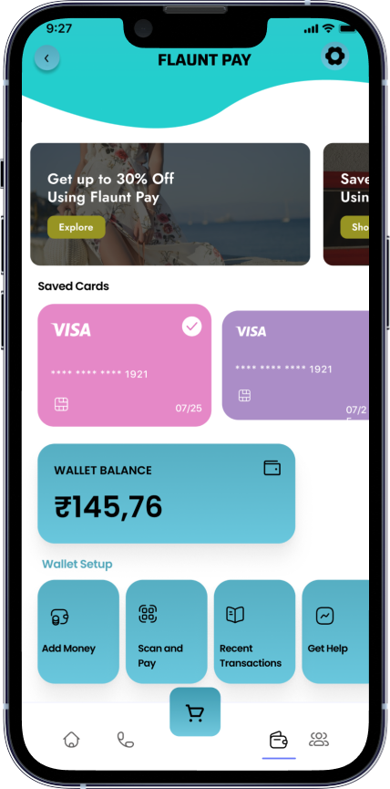

<!--
Hey, thanks for using the awesome-readme-template template.  
If you have any enhancements, then fork this project and create a pull request 
or just open an issue with the label "enhancement".

Don't forget to give this project a star for additional support ;)
Maybe you can mention me or this repo in the acknowledgements too
-->

  
  <h1>FLAUNT ECOMMERCE </h1>
  
  

   A UNIQUE FEATURE RICH ECOMMERCE APPLICATION
   [SEPERATE APP FOR USER AND SELLER]
  

  
  
<!-- Badges -->

 

 

<!-- Table of Contents -->
# DOCREA FUNCTIONALITIES

- ## PACKAGES USED
  - Firebase_auth
  - Firebase_core
  - Cloud_FireStrore
  - Firebase_Storage
  - Razorpay
  - Google Sign-in
  - Equatable
  - Staggered Grid View
  - Flutter_Screen Util
  - Http
  - Getx
  - Liquid Swipe
  - Shared preference
  - Another Stepper
  - Carousel Slider
  - Font Awesome
  - Bottomnav With Sheet
  - Pin Put
 
  <!-- About the Project -->
    
 
  ## FUNCTIONALITIES
  - Category Management (Men, Women, Accessories,Shoes,Gadgets)
  - Order Managent
  - Cart Management
  - Cloud Firestore database
  - Firebase Storage storage
  - Payment Integrated using Razorpay
  - Google Sign In / Sign Up
  - OTP Sign In / Sign up
  - Email Sign In / Sign Up
  - Carousel Sliding
  - Admin Side Order Updating
  - Admin Side Order Adding / Editing / Deleting
  - Admin Side category Adding / Editing / Deleting
  - New Arrival Section (Like Instagram Reels)
  - Order Status Tracking
  - Address Updating
  - Order History
## UPDATES COMING
  - Customer Support (Realtime Database)
  - Google Map Integration(Tracking)
  - Push Notification (Firebase Messaging)
  - Wallet Integration with Qr code
  - Facebook SignIn
  - Speech to Text
  - Video Calling Using API (FOR CUSTOMER SUPPORT) 
 

  

<!-- About the Project -->
## :star2: About the Project

<!-- Screenshots -->
### :camera: Screenshots

 
  

 
  

 
  

 
  

 
  

 
  

